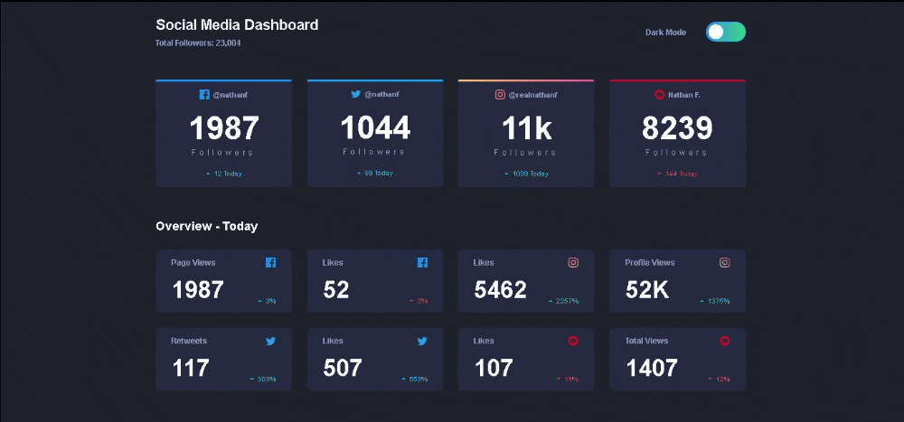

<h1 align="center">Social Media Dashboard</h1>



<br />
<br />

# Comenzando 🚀

## Instalación 🔧

Instalara dependencias.

```npm install```

## Modo desarrollo 🔥
Correrá la aplicación en modo desarrollo. Se abrirá en el puerto 3000 del navegador con el enlace http://localhost:3000.
Cualquier error lo veras en consola de lo contrario te cargara y cualquier cambio se cargara automáticamente 😁.

```
npm start
```

## Despliegue 📦

Creara una carpeta ``build`` con todos los archivos estáticos para probar.
Una vez ya hecho puedes probarlo instalando serve.

```
npm run build
npm i -g serve
serve -s build
```

<br />

## 🛠️ Tecnologias utilizadas

<br />


